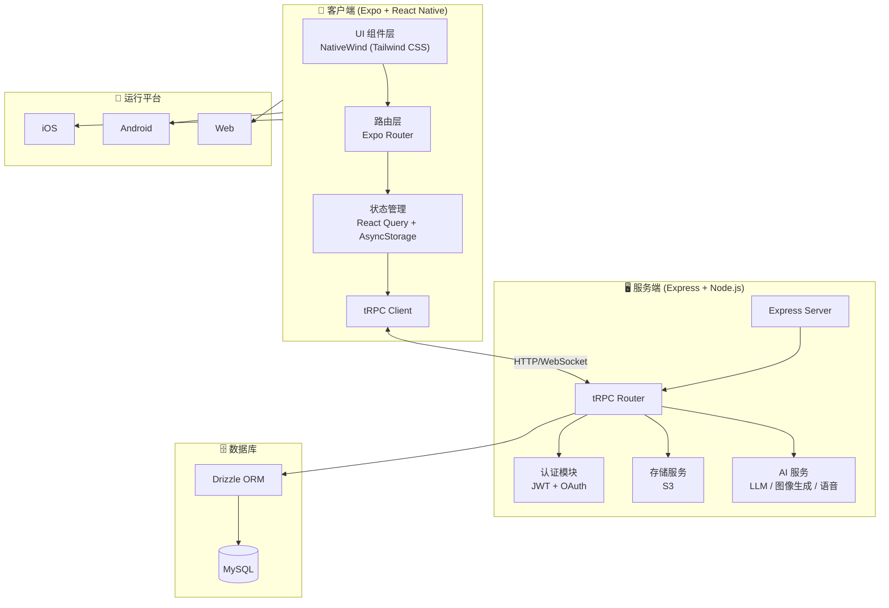
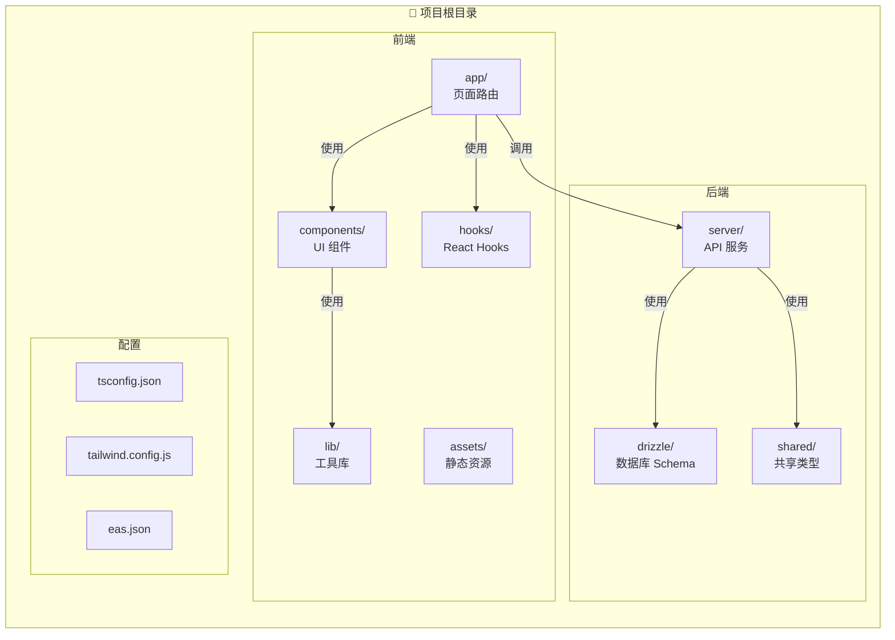
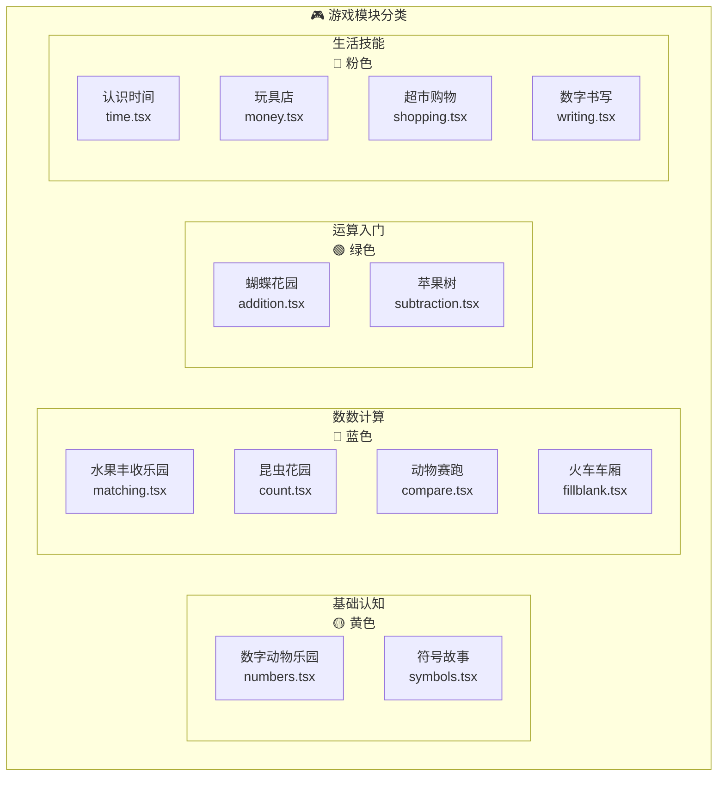

# 数学小天才 (Kids Math App)

一款专为 3-6 岁儿童设计的数学启蒙教育应用，通过互动游戏让孩子快乐学习数学。

## 功能特点

- 12 个精心设计的数学游戏模块
- 可爱的动物和水果主题
- 中文语音反馈
- 进度追踪和奖励系统
- 支持 iOS、Android 和 Web 平台

## 系统架构图



## 项目结构图



## 游戏模块架构



## 游戏模块

| 模块 | 名称 | 内容 |
|------|------|------|
| 基础认知 | 数字动物乐园 | 认识数字 0-10 |
| 基础认知 | 符号故事 | 学习数学符号 |
| 数数计算 | 水果丰收乐园 | 数量对应 |
| 数数计算 | 昆虫花园 | 基础数数 |
| 数数计算 | 动物赛跑 | 大小比较 |
| 数数计算 | 火车车厢 | 数字序列 |
| 运算入门 | 蝴蝶花园 | 加法入门 |
| 运算入门 | 苹果树 | 减法入门 |
| 生活技能 | 认识时间 | 时钟认读 |
| 生活技能 | 玩具店 | 货币认识 |
| 生活技能 | 超市购物 | 购物计算 |
| 生活技能 | 数字书写 | 数字描写 |

## 技术栈

- **前端**: React Native 0.81 + Expo 54 + TypeScript
- **样式**: NativeWind (Tailwind CSS)
- **后端**: Express + tRPC + Drizzle ORM
- **数据库**: MySQL
- **构建**: EAS Build

## 快速开始

### 环境要求

- Node.js 22+
- pnpm 9.12.0+

### 安装依赖

```bash
pnpm install
```

### 开发模式

```bash
# 启动开发服务器（后端 + 前端）
pnpm dev

# 仅启动后端
pnpm dev:server

# 仅启动前端
pnpm dev:metro
```

### 运行应用

```bash
# Android
pnpm android

# iOS
pnpm ios
```

### 其他命令

```bash
pnpm check      # TypeScript 类型检查
pnpm lint       # ESLint 检查
pnpm test       # 运行测试
pnpm db:push    # 数据库迁移
```

## 构建发布

项目使用 EAS Build 进行云端构建：

```bash
# 安装 EAS CLI
npm install -g eas-cli

# 登录 Expo
eas login

# 构建 Android APK（预览版）
eas build --platform android --profile preview

# 构建 iOS（需要 Apple Developer 账号）
eas build --platform ios --profile preview

# 生产版本
eas build --platform all --profile production
```

## CI/CD

项目配置了 GitHub Actions 自动构建。

### 配置 GitHub Secrets

首次使用前，需在仓库 Settings → Secrets and variables → Actions → Secrets 中添加：

| Secret | 说明 | 获取方式 |
|--------|------|----------|
| `EXPO_TOKEN` | Expo 访问令牌 | [expo.dev](https://expo.dev) → Settings → Access Tokens |

### 触发构建

#### 方式一：自动触发

推送代码到 `main` 分支会自动触发构建：

```bash
git push origin main
```

#### 方式二：手动触发

1. 打开仓库的 [Actions](../../actions) 页面
2. 左侧选择 **EAS Build**
3. 点击 **Run workflow**
4. 选择构建参数：
   - **Platform**: `android` / `ios` / `all`
   - **Profile**: `development` / `preview` / `production`
5. 点击绿色 **Run workflow** 按钮

### 构建配置说明

| Profile | 用途 | 输出格式 |
|---------|------|----------|
| `development` | 开发调试 | Debug APK / iOS 模拟器 |
| `preview` | 内部测试 | APK（可直接安装到设备） |
| `production` | 应用商店发布 | AAB (Android) / IPA (iOS) |

### 查看构建结果

- **GitHub Actions**: 查看工作流运行状态和日志
- **Expo Dashboard**: 访问 [expo.dev](https://expo.dev) 查看构建详情、下载安装包

### 注意事项

- 首次构建需要先在本地运行 `eas build` 设置签名凭证
- iOS 构建需要 Apple Developer 账号（$99/年）
- 免费 Expo 账户每月 30 次云端构建额度

## 项目结构

```
├── app/                # 前端页面（Expo Router）
│   ├── (tabs)/         # 底部标签页
│   ├── games/          # 游戏模块
│   └── modules/        # 模块入口
├── components/         # React 组件
├── server/             # 后端代码
│   ├── _core/          # 框架核心（勿修改）
│   ├── db.ts           # 数据库查询
│   └── routers.ts      # API 路由
├── drizzle/            # 数据库 Schema
├── lib/                # 工具库
├── hooks/              # React Hooks
├── assets/             # 静态资源
└── tests/              # 测试文件
```

## 环境变量

### 服务端

- `DATABASE_URL` - MySQL 连接字符串
- `JWT_SECRET` - 会话签名密钥

### 客户端

- `EXPO_PUBLIC_APP_ID` - 应用 ID
- `EXPO_PUBLIC_API_BASE_URL` - API 服务器地址

## 许可证

MIT License
